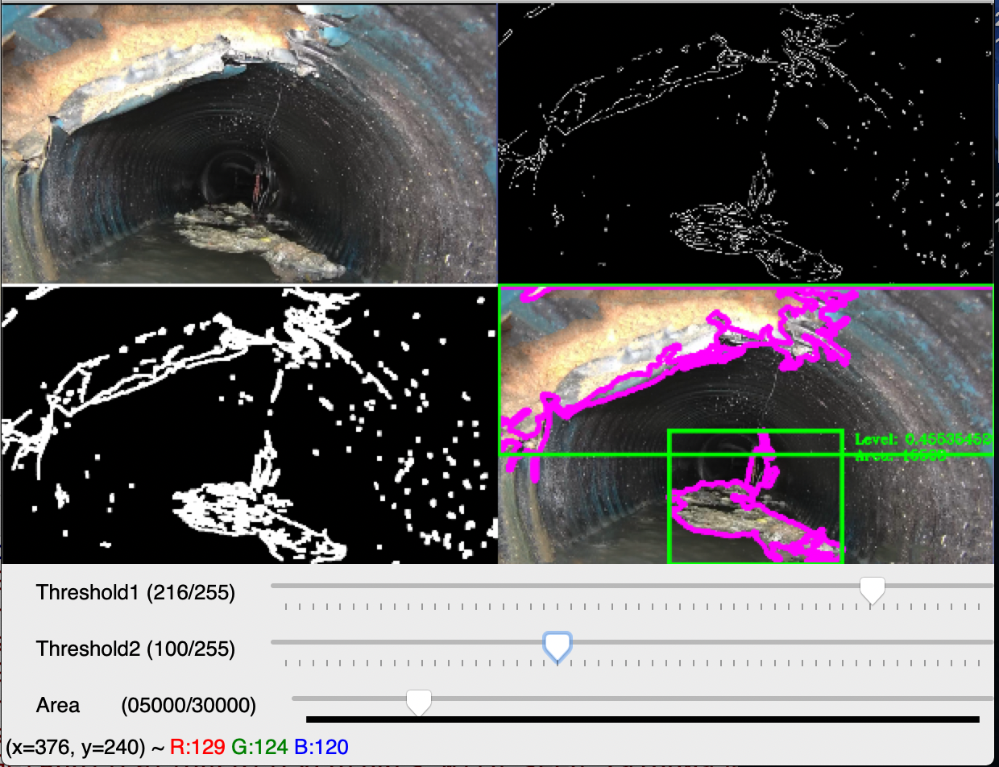

# sewer-defects-measurement

An automated system to measure sewer pipe defects. This is an universal system could be used in any operating system, Windows, Linux and Mac OS.



### Dependencies

- python3
- opencv


### How to use?

- Install the Python3
- Install the dependencies

```bash
pip3 install requirements.txt

```

- Run the processer

```bash
python3 processer.py
```

