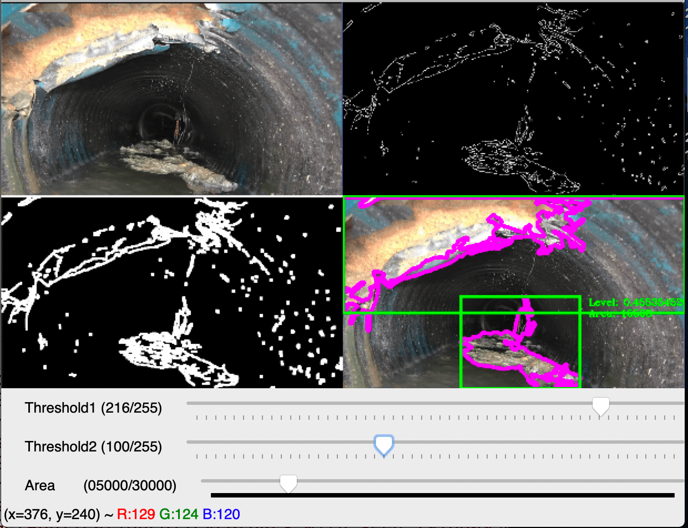

# sewer-defects-measurement

An automated system to measure sewer pipe defects. This is an universal system could be used in any operating system, Windows, Linux and Mac OS.



### Dependencies

- python3
- opencv

### script description

- processer.py: for SongbaiRoad.
  - FRAMES: 1. original image, 2. edge information, 3. Yolo defects detector 4. results
- pipe_calibration.py: run this script will show the calibrated pipe and a defects detector.

### How to use?

- Install the Python3
- Install the dependencies

```bash
pip3 install requirements.txt
```

- Run the processer

```bash
python3 processer.py
```

